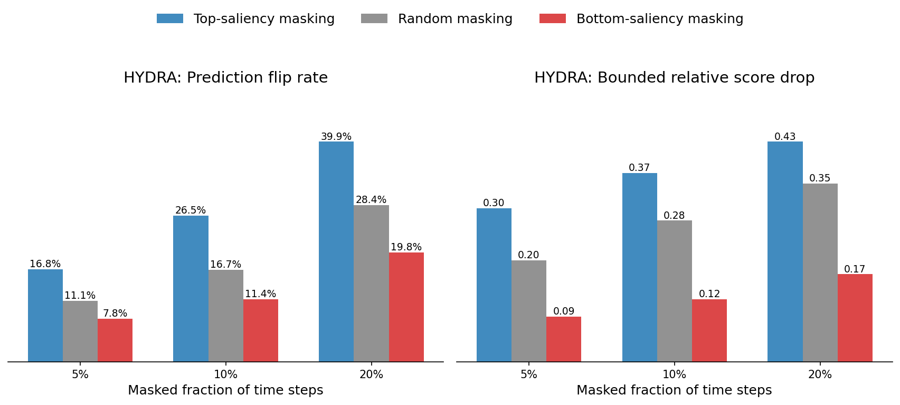
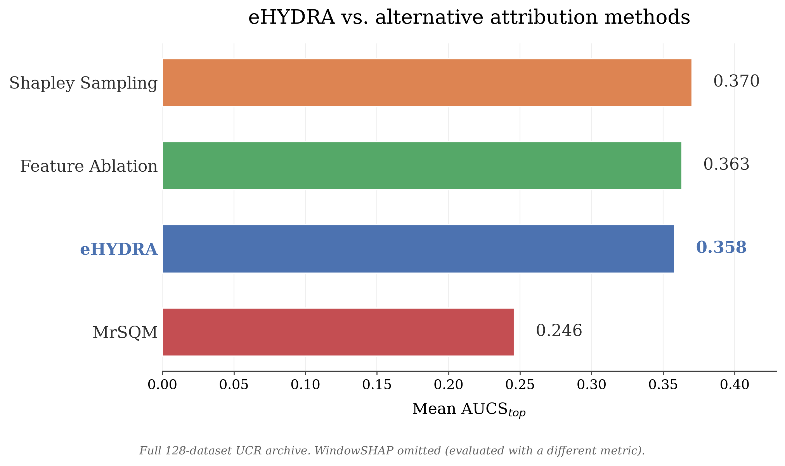

# eHYDRA: An Ante-hoc Explanation Method for the Efficient HYDRA Time Series Classifier

[](LICENSE)
[](https://www.python.org/downloads/release/python-3110/)
[](#citation)

**eHYDRA explains predictions from the HYDRA time series classifier without retraining it, sampling anything, or needing a background distribution.** It
projects the classifier's own Ridge-regression evidence back through HYDRA's convolutional receptive fields onto the original time series in a single closed form pass. Across the full 128 dataset UCR archive it is roughly 3–5x faster than any comparable Shapley based method, is statistically indistinguishable from Shapley Value Sampling in aggregate faithfulness and is the strongest method tested on the high frequency signal regime, all without any configuration.

Code accompanying the MSc thesis *"eHYDRA: An Ante-hoc Explanation Method for the Efficient HYDRA Time Series Classifier"* by Eoin McLoughlin, School of Computer Science, University College Dublin, supervised by Assoc. Prof. Georgiana Ifrim. This repository implements the eHYDRA saliency projection and evaluates it for faithfulness, robustness and comparative quality against post-hoc explainers (WindowSHAP, Shapley Value Sampling, Feature Ablation, TSHAP) and MrSQM's native saliency, across the UCR time series classification archive and a set of synthetic ground-truth datasets.


> **Note on ordering:** The Command Reference below follows the order results are presented in the thesis (data creation → methodology validation → comparison to other explainers → synthetic ground-truth / TSHAP comparison), not the order you'd necessarily run things in a single end-to-end pass. Howevere this has been tested in a fresh environment and everything ran as expected See [Workflow Overview](#workflow-overview) if you want the execution-order version instead.


## Table of Contents

- [Results at a Glance](#results-at-a-glance)
- [Quickstart](#quickstart)
- [Environment Setup](#environment-setup)
- [Data](#data)
- [Repository Structure](#repository-structure)
- [Workflow Overview](#workflow-overview)
- [Command Reference](#command-reference)
  1. [Clustering](#1-clustering)
  2. [Synthetic Ground-Truth Dataset Generation](#2-synthetic-ground-truth-dataset-generation)
  3. [Baseline Saliency Evaluation](#3-baseline-saliency-evaluation)
  4. [Robustness](#4-robustness)
  5. [Comparison to Other Explainers](#5-comparison-to-other-explainers)
  6. [Ground-Truth Comparison & TSHAP](#6-ground-truth-comparison--tshap)
  7. [Timing and Complexity](#7-timing-and-complexity)
  8. [Other / Supporting Scripts](#8-other--supporting-scripts)
- [Built On](#built-on)
- [Citation](#citation)
- [License](#license)
- [Contributing](#contributing)
- [Known Issues / Work in Progress](#known-issues--work-in-progress)


---


## Results at a Glance


*Flip rate and bounded relative score drop under top / random / bottom masking, HYDRA, full 128-dataset archive.*

Mean AUCS̃_top (higher = more faithful, masking the method's top ranked timesteps first causes a larger drop in the predicted class score), full 128 dataset UCR archive, 2,560 samples, HYDRA as the scored model throughout:

| Method | Mean AUCS̃_top | Std | Background required? | Median time/sample (full-128, CUDA) |
|---|---|---|---|---|
| Shapley Value Sampling | 0.370 | 0.267 | mean-value coalition | 0.970s |
| Feature Ablation | 0.363 | 0.265 | mean-value coalition | 0.041s |
| **eHYDRA (ours)** | **0.358** | 0.289 | **none** | **0.185s** |
| MrSQM (native) | 0.246 | 0.228 | n/a | <0.001s* |



*\*MrSQM reads saliency directly from its own symbolic model's coefficients rather than computing an explanation for a separate classifier, so its timing isn't directly comparable to the other four methods — see below.*

eHYDRA is statistically indistinguishable from Shapley Value Sampling on score drop at the 38 dataset subset scale, is 3–5x faster than any TSHAP condition or Shapley Value Sampling and requires no background distribution or coalition sampling hyperparameters of any kind. Adding TSHAP to the comparison (with a non-trivial background) outperforms all other methods tested, but eHYDRA leads specifically in the high-frequency/high-curvature signal-morphology cluster and matches TSHAP's region agreement in the spiky/multi-class cluster even where TSHAP's localisation advantage is largest. See the thesis for the full breakdown by signal morphology cluster, masking fraction and evaluation metric.


### Timing and Complexity

Per-method timing is reported across two separate conditions rather than one consolidated run. The numbers below are accurate but **not directly comparable to each other**, since they differ in both hardware and evaluation scale.


**38-dataset stratified subset, CPU** (`run_windowshap_comparison.py`, `run_captum_comparison.py` without `--device cuda`):

| Method | Median time (s) | Relative to eHYDRA |
|---|---|---|
| MrSQM (native) | <0.001 | eHYDRA ~200x slower — see note above |
| Feature Ablation | 0.059 | eHYDRA 3.4x slower |
| **eHYDRA** | **0.202** | — |
| WindowSHAP | 0.960 | eHYDRA ~5x faster |
| Shapley Value Sampling | 1.387 | eHYDRA 6.8x faster |


**Full 128-dataset archive, CUDA** (`run_captum_comparison.py --device cuda`, TSHAP conditions via `--tshap-train-background`):

| Method | Median time (s) | Relative to eHYDRA |
|---|---|---|
| MrSQM (native) | <0.001 | eHYDRA ~200x slower — see note above |
| Feature Ablation | 0.041 | eHYDRA 4.5x slower |
| **eHYDRA** | **0.185** | — |
| TSHAP (zero background) | 0.590 | eHYDRA 3.2x faster |
| TSHAP (centroid background) | 0.620 | eHYDRA 3.4x faster |
| TSHAP (train background) | 0.840 | eHYDRA 4.5x faster |
| Shapley Value Sampling | 0.970 | eHYDRA 5.2x faster |


eHYDRA's own median time is nearly identical across both conditions (0.202s CPU vs. 0.185s CUDA) as expected since eHYDRA's projection is a single fixed cost closed form pass and doesn't benefit much from GPU parallelism the way coalition sampling methods do.


**Complexity.** eHYDRA's cost advantage is structural, not just empirical, each method's cost below is in terms of forward model evaluations required per explained instance:

| Method | Model calls | Background required? | Tunable hyperparameters |
|---|---|---|---|
| eHYDRA | O(1), closed-form | No | None |
| MrSQM (native) | O(1), native | No | None |
| Feature Ablation | O(n) | Yes | Segment count *n* |
| WindowSHAP | O(n·s) | Yes | Segments *n*, samples *s* |
| Shapley Value Sampling | O(n·p) | Yes | Segments *n*, permutations *p* |
| TSHAP | O(k), exact per-window closed-form | Yes | Window count *k*, background |

eHYDRA and MrSQM are the only methods requiring no coalition or ablation loop at all. Every other method's cost scales with a chosen segmentation or sampling budget, on top of requiring a background distribution — itself a design choice shown in the thesis (Section 5, TSHAP Comparison) to materially affect faithfulness.


---

## Environment Setup

**A `requirements.txt` has been committed to this repository** with which you can installed the exact version used during eHYDRA's development

```bash
# Create and activate a virtual environment (Conda)
conda create -n hydra_env python=3.13.14
conda activate hydra_env


# Create a virtual environment (Venv)
python3.13 -m venv hydra_env
# macOS/Linux
source hydra_env/bin/activate

# Windows (cmd)
hydra_env\Scripts\activate.bat

# Windows (PowerShell)
hydra_env\Scripts\Activate.ps1

# Install the requirements.txt file
pip install -r requirements.txt
```

A CUDA capable GPU is recommended but not required for most scripts, model classes generally default to `torch.device("cuda" if torch.cuda.is_available()
else "cpu")`. `--device` is only exposed as a CLI flag on `scripts/tscaptum/run_captum_comparison.py`; no other script accepts it.


**Tested configuration:** Python 3.13.14, Linux (Ubuntu 26.04 LTS), with and without a CUDA GPU. Not tested on macOS or Windows, both should work in principle (no OS specific code paths), but haven't been verified, I have found that trying to run MrSQM on windows causes problems to do with specific windows drivers and running it through WSL was painfully slow hence the move to Ubuntu.


## Quickstart

Minimal path from a fresh clone to a first result, using a small stratified subset so it completes quickly. Assumes the environment is already set up (see [Environment Setup](#environment-setup)) and `data/summary.csv` / `data/ucr_dataset_types.csv` are present.

```bash
# Step 1: Build the signal morphology clusters (required by almost everything else)
python main.py cluster

# Step 2: Run a quick HYDRA ablation check on a small subset (~10 datasets/cluster)
python scripts/robustness_testing/run_hydra_ablation.py \
  --closest-csv outputs/clustering/csv/closest_20_datasets_per_cluster.csv \
  --output-dir outputs/saliency/ablation_quickstart \
  --datasets-per-cluster 10 \
  --fraction 0.10 \
  --max-samples-per-dataset 20 \
  --seed 42

# Step 3: Inspect the result
cat outputs/saliency/ablation_quickstart/hydra_saliency_ablation_summary.csv
```

If step 3 shows four saliency variants (`max_only`, `min_only`, `min_activation_scaled`, `combined`) with non-null flip-rate and score-drop columns, the environment is working end to end. From here, see the [Workflow Overview](#workflow-overview) for the full pipeline, or jump directly to the [Command Reference](#command-reference) section you need.


## Data

All experiments use the [UCR Time Series Classification Archive](https://www.timeseriesclassification.com/) (Dau et al., 2019), fetched at runtime via [`aeon`](https://github.com/aeon-toolkit/aeon) rather than redistributed in this repository. `data/summary.csv` and `data/ucr_dataset_types.csv` list which of the 128 datasets are used and their UCR assigned type metadata. The underlying series are downloaded and cached locally by `aeon` the first time a dataset is requested (needs network access on first run). The UCR archive is provided for academic, non-commercial research use (see the archive's own terms for details).

`data/synthetic_dataset/` is generated locally by this repository (see [Section 2](#2-synthetic-ground-truth-dataset-generation)) and requires no external download.


## Repository Structure

```
HYDRA-Saliency/
├── main.py                        # Entry point for the small set of single-step commands
├── classes/                       # Core model, explainer and analysis classes
│   ├── models/                    # HYDRA / MrSQM / LR model wrappers
│   ├── clustering.py              # Signal morphology feature extraction & clustering
│   ├── cluster_analysis.py        # Cluster validation, profiling and diagnostic plots
│   ├── windowshap.py              # WindowSHAP-style KernelSHAP baseline
│   ├── captum_comparison.py       # tsCaptum multi-method comparison runner
│   ├── captum_analysis.py         # Post-hoc reporting / plotting for captum_comparison runs
│   ├── saliency_ablation.py       # Max / min saliency-construction ablation
│   ├── margin_saliency_evaluation.py
│   ├── sanity_checks.py           # Seed stability, label / weight permutation control tests
│   ├── perturbation_robustness.py # Perturbation operator sensitivity
│   ├── saliency_evaluator.py      # General correctness stratified masking evaluator
│   └── qualitative_plots.py       # Shared saliency plotting utilities
│   
├── utils/
│   ├── cli.py                     # Shared CLI helpers (dataset selection, etc.)
│   ├── data_utils.py              # UCR dataset loading, HYDRA input-shape adaptation
│   └── explainability.py          # Core saliency/masking primitives
│   
├── scripts/
│   ├── pipeline/
│   │   ├── run_saliency_all.py           # Full baseline HYDRA / LR / MrSQM masking evaluation
│   │   ├── run_saliency_dataset.py       # Single dataset variant of the above
│   │   ├── combine_saliency_outputs.py   # Merge per-dataset saliency outputs
│   │   └── train_hydra_on_synthetic.py   # Train HYDRA on generated synthetic datasets
│   │
│   ├── robustness_testing/
│   │   ├── run_hydra_ablation.py         # Max / min saliency construction ablation
│   │   ├── run_sanity_checks.py          # Seed stability, label / weight permutation control tests
│   │   ├── run_perturbation_operators.py # Perturbation operator sensitivity
│   │   ├── run_correctness_supplement.py # Correct vs. incorrect prediction stratification
│   │   ├── run_margin_saliency.py        # Predicted class vs. margin saliency
│   │   └── run_windowshap_comparison.py  # HYDRA vs. WindowSHAP baseline
│   │
│   ├── tscaptum/
│   │   ├── run_captum_comparison.py      # tsCaptum multi-method comparison (incl. TSHAP)
│   │   ├── run_captum_analysis.py        # Reporting / plotting entry point for classes/captum_analysis.py
│   │   └── check_tshap_scaling.py        # TSHAP runtime scaling diagnostic
│   │
│   ├── analysis/
│   │   ├── analyse_deletion_curves_by_cluster.py    # AUCS̃_top by cluster, metric agreement, morphology vs IoU
│   │   ├── analyse_perturbation_operators.py        # Flip-rate / score-drop / Wilcoxon tables by operator
│   │   ├── run_confidence_stratification.py         # Faithfulness by prediction confidence bin
│   │   ├── run_morphology_disagreement.py           # Morphology features vs. HYDRA / WindowSHAP agreement
│   │   ├── test_smooth_cluster_composition.py       # Smooth cluster compositional bias testing
│   │   ├── evaluate_synthetic_ground_truth.py       # Ground truth saliency evaluation on synthetic data
│   │   ├── evaluate_tshap_comparison.py             # TSHAP specific synthetic ground truth evaluation 
│   │   ├── saliency_ground_truth_metrics.py         # Shared metrics (cosine similarity, precision/recall/F1, top-q% overlap) for ground truth evaluation
│   │   ├── summarize_ground_truth_results.py        # Aggregate ground truth evaluation results
│   │   ├── compare_methods_significance.py          # Cross method statistical comparison 
│   │   ├── evaluate_random_baseline.py              # Random attribution chance floor baseline
│   │   └── test_saliency_ground_truth_metrics.py    # Unit tests for saliency_ground_truth_metrics.py
│   │
│   ├── plotting/
│   │   ├── plot_saliency_figures.py         # Main flip-rate/score-drop bar charts + cluster heatmap
│   │   ├── plot_tshap_qualitative.py        # HYDRA / TSHAP qualitative comparison plot
│   │   ├── run_qualitative_plot.py          # HYDRA / MrSQM / WindowSHAP Comparison plot
│   │   ├── plot_tshap_comparison.py         # TSHAP specific comparison figures 
│   │   └── plot_ground_truth_comparison.py  # Synthetic ground truth evaluation figures 
│   │
│   ├── synthetic_dataset_generation/
│   │   ├── calibration.py                    # Derive per-cluster generator parameters from the clustering CSV
│   │   ├── generate_datasets.py              # Generate the synthetic datasets
│   │   ├── dataset_io.py                     # Load/save synthetic dataset artifacts
│   │   ├── validate_reproduction.py          # Bit-exact reproduction + recovered-parameter checks
│   │   ├── smoke_test.py                     # Full generator smoke test
│   │   ├── analyze_real_spiky_features.py    # Real-data feature analysis informing the Spiky generator (*purpose inferred)
│   │   ├── inspect_real_spiky_examples.py    # Manual inspection helper for Spiky-cluster examples (*purpose inferred)
│   │   └── tests/                            # Per-generator unit tests
│   │       ├── test_frequency_burst.py
│   │       ├── test_level_shift.py
│   │       ├── test_spike_multiclass.py
│   │       └── test_calibration.py
│   │
│   └── tests/
│       ├── test_captum_smoke.py     # Smoke test for the tsCaptum comparison pipeline
│       ├── test_saliency_smoke.py   # Smoke test for the core saliency pipeline
│       └── test_model_imports.py    # Confirms all model classes import cleanly
│   
├── data/
│   ├── summary.csv                # Full UCR-128 dataset list
│   ├── ucr_dataset_types.csv      # UCR archive Type metadata
│   └── synthetic_dataset/         # Generated synthetic datasets
│   
└── outputs/                       # All experiment results (see note below)
```

> **Note on `outputs/`:** Initially plots were stored inside the folders where the data used to generate them was stored
> E.g. `outputs/saliency/imgs`, This however started to get messy over time and I've done one refactor to move most img plots to 
> `outputs/plot/` However some may still point to thier original save locations
>  Save directory information is displayed after a command is run will update it eventually 


## Workflow Overview

If you're running the pipeline end-to-end rather than looking up one command, the practical execution order is:

1. **Clustering:** Cluster the UCR archive into signal-morphology groups (required before any script referencing `closest_20_datasets_per_cluster.csv`).

2. **Generate the synthetic ground-truth datasets:**  Independent of the real data steps below, so this can happen at any point once clustering is done, but is needed before step 6.

3. **Run the baseline saliency evaluation:** (HYDRA vs. LR vs. MrSQM) to establish the core faithfulness result.

4. **Run robustness checks:** This is run against that baseline above, ablation, control tests, perturbation operator sensitivity, correctness stratification, margin saliency, confidence stratification.

5. **Compare against other explainers:** The method is currently able to be compared against WindowSHAP, tsCaptum's Shapley Sampling / Feature Ablation and TSHAP at both the 38-dataset stratified subset and full 128-dataset scale.

6. **Train HYDRA on the synthetic data and evaluate against it:** This is used as a ground truth faithfulness check that doesn't rely on perturbation as a proxy, including the TSHAP vs eHYDRA synthetic comparison.

7. **Evaluate timing and complexity:** Largely produced as a byproduct of steps 5 & 6's comparison runs rather than a separate dedicated script.


## Command Reference
Unless noted otherwise, all commands are run from the repository root. Ive laid out the order of commands below to align with reading the thesis. Specifically, data creation, methodology validation, comparison to other explainers, then the synthetic ground-truth / TSHAP comparison.


### 1. Clustering
**Build signal-morphology clusters**  Groups the 128 UCR datasets into 4 morphology clusters (High-frequency, Smooth, Short/rough, Spiky) via agglomerative clustering on 16 standardised signal features. Required before any script referencing `closest_20_datasets_per_cluster.csv`.

```bash
python main.py cluster --n-clusters 4 --seed 42
```
| Flag | Meaning |
|---|---|
| `--n-clusters` | Number of clusters (default: 4) |
| `--seed` | Random seed (default: 42) |

---

### 2. Synthetic Ground Truth Dataset Generation
Generates synthetic datasets with known discriminative regions, this is used as an evaluation approach independent of perturbation based proxies. It doesn't depend on anything except clustering having been run once (for the per-cluster calibration step below). The actual comparison of eHYDRA against this data happens later, in [Ground-Truth Comparison & TSHAP](#6-ground-truth-comparison--tshap).

```bash
# Derive per-cluster generator parameters from the clustering CSV
python3 scripts/synthetic_dataset_generation/calibration.py

# Unit tests for each generator
python3 scripts/synthetic_dataset_generation/tests/test_frequency_burst.py
python3 scripts/synthetic_dataset_generation/tests/test_level_shift.py
python3 scripts/synthetic_dataset_generation/tests/test_spike_multiclass.py
python3 scripts/synthetic_dataset_generation/tests/test_calibration.py

# 3. Validate bit-exact reproduction and recovered parameters
python3 scripts/synthetic_dataset_generation/validate_reproduction.py

# 4. Full smoke test
python3 scripts/synthetic_dataset_generation/smoke_test.py

# 5. Generate the actual datasets (defaults to data/synthetic_dataset/)
python3 scripts/synthetic_dataset_generation/generate_datasets.py \
  --cluster all --n-samples 300 --seed 42
```
| Flag | Meaning |
|---|---|
| `--cluster` | Which cluster's generator to run (`all` for every cluster) |
| `--n-samples` | Number of synthetic samples to generate per cluster |
| `--seed` | Random seed |
| `--out-dir` | Override the default `data/synthetic_dataset/` output location |

---

### 3. Baseline Saliency Evaluation

**Run the HYDRA / LR / MrSQM masking evaluation** across the full archive. This produces the `masking_original_report` style output consumed by the baseline flip-rate / score-drop tables.

```bash
# This recreates the set of results in outputs/saliency/masking_original_report
# This command can take a long time to run
# If running and want to restart from a previous location in a run remove the --overwrite flag
python scripts/pipeline/run_saliency_all.py \
  --models lr hydra mrsqm \
  --summary-csv data/summary.csv \
  --output-dir outputs/saliency/<output_name> \
  --fractions 0.05,0.10,0.20 \
  --random-repeats 5 \
  --seed 42 \
  --overwrite
```
| Flag | Meaning |
|---|---|
| `--models` | Which model(s) to fit and evaluate (default: `lr hydra mrsqm`) |
| `--summary-csv` | CSV listing the datasets to run on (default: `data/summary.csv`, i.e. full archive) |
| `--output-dir` | Where per-dataset/per-model results are written |
| `--fractions` | Comma-separated masking fractions (default: `0.05,0.10,0.20`) |
| `--random-repeats` | Number of random-baseline draws per sample (default: 5) |
| `--max-samples` | Cap on correctly-classified test samples per dataset (default: unset — uses the full test set) |
| `--seed` | Random seed (default: 42) |
| `--overwrite` | Force recomputation even if per-dataset output files already exist |


**Regenerate the summary tables** from a saliency output directory:
```bash
# Using a new set of generated results
python main.py analyse-saliency \
  --saliency-output-dir outputs/saliency/<output_name> \
  --analysis-dir outputs/saliency/analysis_<output_name> \
  --fraction 0.10


# Using the original runs results:
python main.py analyse-saliency \
  --saliency-output-dir outputs/saliency/masking_original_report \
  --analysis-dir outputs/saliency/masking_report_analysis \
  --fraction 0.10
```

| Flag | Meaning |
|---|---|
| `--saliency-output-dir` | Directory produced by `run_saliency_all.py` |
| `--analysis-dir` | Where summary tables are written |
| `--fraction` | Masking fraction to summarise (default: 0.10) |


**Regenerate the corresponding figures:**
```bash
python main.py plot-saliency \
  --analysis-dir outputs/saliency/analysis_<output_name> \
  --figure-dir outputs/saliency/imgs

# Example:
python main.py plot-saliency \
  --analysis-dir outputs/saliency/masking_report_analysis \
  --figure-dir outputs/saliency/imgs
```

---

### 4. Robustness

**Max/min saliency-construction ablation:** Compares four variants of how HYDRA's max/min convolutional features are projected into saliency (max-only, min-only, activation-scaled min, combined).

```bash
python scripts/robustness_testing/run_hydra_ablation.py \
  --closest-csv outputs/clustering/csv/closest_20_datasets_per_cluster.csv \
  --output-dir outputs/saliency/ablation \
  --datasets-per-cluster 10 \
  --fraction 0.10 \
  --max-samples-per-dataset 20 \
  --seed 42
```


Run on the full archive by pointing `--closest-csv` at the full cluster
assignment file and omitting `--datasets-per-cluster`:

```bash
python scripts/robustness_testing/run_hydra_ablation.py \
  --closest-csv outputs/clustering/csv/ucr_dataset_clusters_k4.csv \
  --output-dir outputs/saliency/ablation_full128 \
  --fraction 0.10 \
  --max-samples-per-dataset 20 \
  --seed 42
```

| Flag | Meaning |
|---|---|
| `--closest-csv` | Dataset-selection CSV; also accepts a full cluster-assignment CSV for archive-wide runs |
| `--datasets` | Explicit list of dataset names, overrides `--closest-csv` entirely |
| `--datasets-per-cluster` | Take the closest N datasets per cluster (omit for all datasets in the file) |
| `--fraction` | Masking fraction (default: 0.10) |
| `--max-samples-per-dataset` | Cap on samples per dataset (default: 20) |
| `--seed` | Random seed (default: 42) |

**Margin saliency:** Compares predicted class saliency against margin
saliency (predicted class minus the runner up class).

```bash
python scripts/robustness_testing/run_margin_saliency.py \
  --closest-csv outputs/clustering/csv/closest_20_datasets_per_cluster.csv \
  --output-dir outputs/saliency/margin_saliency \
  --datasets-per-cluster 10 --fraction 0.10 --seed 42
```

**Control tests:** Including seed stability (5 refits), label permutation, and weight permutation to confirm the saliency map encodes genuine class discriminative information rather than a generic evaluation artefact.

```bash
python scripts/robustness_testing/run_sanity_checks.py \
  --closest-csv outputs/clustering/csv/closest_20_datasets_per_cluster.csv \
  --output-dir outputs/saliency/sanity_checks \
  --datasets-per-cluster 10 --n-seeds 5 --fraction 0.10 --seed 42
```

| Flag | Meaning |
|---|---|
| `--n-seeds` | Number of independent HYDRA refits for the seed-stability check (default: 5) |
| *(other flags as above)* | |


**Perturbation-operator sensitivity:** Tests whether the faithfulness ordering survives replacing the masking operator (global mean, local mean, linear interpolation, blur).

```bash
python scripts/robustness_testing/run_perturbation_operators.py \
  --closest-csv outputs/clustering/csv/closest_20_datasets_per_cluster.csv \
  --output-dir outputs/saliency/perturbation_operators \
  --datasets-per-cluster 10 \
  --fractions 0.05,0.10,0.20 \
  --max-samples-per-dataset 20 \
  --seed 42
```

Full-archive variant (adds `blur`, resumable):

```bash
python scripts/robustness_testing/run_perturbation_operators.py \
  --full-archive \
  --output-dir outputs/saliency/perturbation_operators_full \
  --operators global_mean local_mean linear_interpolation blur \
  --fractions 0.05,0.10,0.20 \
  --max-samples-per-dataset 50 \
  --seed 42
```

| Flag | Meaning |
|---|---|
| `--full-archive` | Run on all UCR datasets rather than a stratified subset |
| `--operators` | Which masking operator(s) to test |
| `--fractions` | Comma-separated masking fractions |
| *(other flags as above)* | |

Analyse the resulting samples at a given fraction:

```bash
python scripts/analysis/analyse_perturbation_operators.py \
  --samples-csv outputs/saliency/perturbation_operators/perturbation_operator_samples.csv \
  --output-dir outputs/saliency/perturbation_operators/analysis \
  --fraction 0.10
```

**Correctness stratification:** Reruns the HYDRA masking evaluation with incorrect predictions included to test whether the faithfulness signal depends on the prediction being correct.

```bash
python scripts/robustness_testing/run_correctness_supplement.py \
  --closest-csv outputs/clustering/csv/closest_20_datasets_per_cluster.csv \
  --output-dir outputs/saliency/correctness_supplement \
  --datasets-per-cluster 10 \
  --models hydra \
  --seed 42
```

| Flag | Meaning |
|---|---|
| `--models` | Which model(s) to evaluate (choices: `lr`, `hydra`, `mrsqm`) |
| *(other flags as above)* | |


**Confidence stratification:** Tests whether the faithfulness signal is concentrated in low-confidence predictions. Reuses an existing baseline saliency output, no model refitting required.

```bash
python scripts/analysis/run_confidence_stratification.py \
  --saliency-output-dir outputs/saliency/<output_name> \
  --output-dir outputs/saliency/confidence_stratification \
  --model HYDRA \
  --fraction 0.10 \
  --n-bins 3
```

| Flag | Meaning |
|---|---|
| `--model` | Which model's results to stratify |
| `--n-bins` | Number of confidence quantile bins (default: 3) |


---


### 5. Comparison to Other Explainers

**WindowSHAP comparison:** HYDRA saliency vs. a model agnostic KernelSHAP baseline, measuring window overlap (IoU) and perturbation sensitivity.

```bash
python scripts/robustness_testing/run_windowshap_comparison.py \
  --closest-csv outputs/clustering/csv/closest_20_datasets_per_cluster.csv \
  --output-dir outputs/saliency/windowshap \
  --datasets-per-cluster 10 \
  --n-segments 100 \
  --shap-nsamples 500 \
  --max-samples-per-dataset 20 \
  --seed 42
```

| Flag | Meaning |
|---|---|
| `--n-segments` | Number of temporal segments KernelSHAP treats as coalition features |
| `--shap-nsamples` | Number of coalition samples for KernelSHAP |
| *(other flags as above)* | |

> Also produces `hydra_windowshap_samples_with_clusters.csv`, required by
> `run_morphology_disagreement.py` below.


**tsCaptum multi-method comparison:** Compares HYDRA vs. Shapley Value Sampling, Feature Ablation, MrSQM native saliency and (optionally) TSHAP.

```bash
python scripts/tscaptum/run_captum_comparison.py \
    --all-datasets \
    --output-dir outputs/saliency/captum_comparison_full128 \
    --n-segments 20 \
    --device cuda
```


**TSHAP scaling check:** (run this first before enabling TSHAP on a large run (see the diagnostic note below)):

```bash
python scripts/tscaptum/check_tshap_scaling.py \
    --all-datasets \
    --output-csv outputs/saliency/tshap_scaling_check_full128.csv
```

Add TSHAP with a specific background condition:

```bash
python scripts/tscaptum/run_captum_comparison.py \
  --datasets-per-cluster 10 \
  --n-segments 20 \
  --tshap-train-background \
  --tshap-train-background-samples 20 \
  --device cuda \
  --output-dir outputs/saliency/captum_comparison_tshap
```

| Flag | Meaning |
|---|---|
| `--all-datasets` | Run on the full 128-dataset archive |
| `--datasets-per-cluster` | Use a stratified subset instead |
| `--n-segments` | Number of temporal segments for Shapley/Feature Ablation |
| `--tshap-train-background` | Include TSHAP with a train-set background (in addition to the default centroid/zero backgrounds) |
| `--tshap-train-background-samples` | Number of background samples for the train condition |
| `--device` | `cpu` or `cuda` (default: `cpu`). **This is the only script with a `--device` flag.** |


**Deletion-curve analysis by morphology cluster:** No CLI arguments, paths
are hardcoded to the full 128 tsCaptum run.

```bash
python scripts/analysis/analyse_deletion_curves_by_cluster.py
```

Requires `captum_pairwise_samples.csv`, `captum_cluster_deletion_summary.csv`, and `captum_cluster_overlap_summary.csv` to already exist in
`outputs/saliency/captum_comparison_full128/`.


**Morphology disagreement:** Correlates HYDRA vs WindowSHAP agreement against continuous morphology features. *(Depends on the WindowSHAP comparison above)*

```bash
python scripts/analysis/run_morphology_disagreement.py \
  --windowshap-samples outputs/saliency/windowshap/hydra_windowshap_samples_with_clusters.csv \
  --feature-csv outputs/clustering/csv/ucr_dataset_clusters_k4.csv \
  --output-dir outputs/saliency/morphology_disagreement \
  --fraction 0.10
```

**Smooth-cluster composition:** Checks whether a compositional bias
in the Smooth cluster subset is genuine or a statistical-power artefact.

```bash
python scripts/analysis/test_smooth_cluster_composition.py \
    --full128-dir outputs/saliency/captum_comparison_tshap_full128 \
    --cluster-csv outputs/clustering/csv/ucr_dataset_clusters_k4_with_types.csv \
    --closest-csv outputs/clustering/csv/closest_20_datasets_per_cluster.csv
```

**Qualitative saliency comparison figure:** (HYDRA / MrSQM / WindowSHAP or TSHAP overlay on one sample):

```bash
python scripts/plotting/plot_tshap_qualitative.py \
    --dataset GunPoint \
    --sample-index 0 \
    --output outputs/figures/tshap_qualitative/GunPoint_0.png
```

| Flag | Meaning |
|---|---|
| `--dataset` | UCR dataset name |
| `--sample-index` | Which correctly-classified test sample to visualise (try a few values) |
| `--output` | Output image path |


---


### 6. Ground-Truth Comparison & TSHAP

**Train HYDRA on the synthetic data:** (from [Section 2](#2-synthetic-ground-truth-dataset-generation)):

```bash
python3 scripts/pipeline/train_hydra_on_synthetic.py --cluster all --save-models
```

TODO (Need to add flag tables for the following:):
> **Documentation gap:** the scripts that actually run the eHYDRA-vs-Phi and eHYDRA-vs-TSHAP synthetic ground-truth comparisons:
> `scripts/analysis/evaluate_synthetic_ground_truth.py`,
> `scripts/analysis/evaluate_tshap_comparison.py`,
> `scripts/analysis/evaluate_random_baseline.py`,
> `scripts/analysis/summarize_ground_truth_results.py`,
> `scripts/analysis/compare_methods_significance.py`,
> `scripts/plotting/plot_ground_truth_comparison.py` exist in the repo
> (see [Repository Structure](#repository-structure)) but I haven't added flag tables for this section but they do exist in the commad execution order.


---


## Built On

This work builds directly on, and evaluates against, the following methods
and their reference implementations:

- **HYDRA** — Dempster, Schmidt & Webb (2023), *HYDRA: Competing Convolutional Kernels for Time Series Classification*. [Paper](https://doi.org/10.1007/s10618-023-00939-3) · [Code](https://github.com/angus924/hydra)
- **MrSQM** — Nguyen & Ifrim (2021), *MrSQM: Fast Time Series Classification with Symbolic Representations*. [Code](https://github.com/mlgig/mrsqm)
- **WindowSHAP** — Nayebi et al. (2023), *WindowSHAP: An Efficient Framework for Explaining Time-Series Classifiers Based on Shapley Values*. [Paper](https://doi.org/10.1016/j.jbi.2023.104438)
- **SHAP** — Lundberg & Lee (2017), *A Unified Approach to Interpreting Model Predictions*. [Code](https://github.com/shap/shap)
- **tsCaptum** — Serramazza et al. (2024), *tsCaptum*. [Code](https://github.com/mlgig/tsCaptum)
- **TSHAP** — Le Nguyen & Ifrim (2025), a closed-form sliding-window Shapley method for time series. [Code](https://github.com/mlgig/tshap)
- **UCR Archive** — Dau et al. (2019), *The UCR Time Series Archive*. [Archive](https://www.timeseriesclassification.com/)
- **aeon** — the `aeon` toolkit, used for dataset loading and several baseline classifiers. [Code](https://github.com/aeon-toolkit/aeon)

See the thesis References chapter for the complete bibliography and full citations for every method and evaluation protocol referenced in the code comments.


## Citation

If you use this code, the eHYDRA method or the synthetic ground truth generators, please cite the thesis:

```bibtex
@mastersthesis{mcloughlin2026ehydra,
  title = {eHYDRA: An Ante-hoc Explanation Method for the Efficient HYDRA Time Series Classifier},
  author = {McLoughlin, Eoin},
  school = {University College Dublin},
  year = {2026},
  type = {MSc thesis},
  note = {Supervised by Georgiana Ifrim}
}
```

A machine readable [`CITATION.cff`](CITATION.cff) is also included.

## License

Released under the [MIT License](LICENSE). The UCR archive and other third party data/code referenced above retain their own respective licenses, see [Data](#data) and [Built On](#built-on).


## Contributing

This is thesis-accompanying research code, not an actively maintained library. It's shared to support reproducibility and reuse, not as a production ready package. That said:

- **Issues and questions are welcome:** If something doesn't run or a result doesn't reproduce, please open an issue with your environment details and the exact command you ran.

- **Pull requests:** For bug fixes are welcome, larger feature additions are probably better as your own fork, since this repo is meant to stay a faithful record of what the thesis actually ran (For now).

- **Future Work:** I do have plans to wrap this up into a more easily accessible pip package along with adding some extra functionality but there I'm not holding myself to a strict timeline for when this will happen.
  
- Theres also no guaranteed response time as this is maintained on a  best effort basis outside of active thesis work.


## Known Issues / Work in Progress

This is a fresh repo that I've moved the code to for the final push however this the code within this repo has gone through several refactors during the course of the thesis. Items below are tracked and being worked through, but may not be fully resolved by the final deadline **(30/08/2026)**:

- **Output directory naming/saving is inconsistent.** `outputs/saliency/imgs`, `outputs/plots/...`, and `outputs/figures/...` are all currently in use
  for conceptually the same thing (generated figures). A consolidation to a single `plots/` location under `data/outputs/` is planned. As the project was growing I altered what would be the best place to store files, originally all accompanying plots/visualisations were all saved within their respective experiment folders however as the repo and number of experiments grew this became less maintainable & traversable. I did somewhat of a refactor to try consolidate all generated images within `outputs/plots/` but some may still be saved to thier experiment folders or within `outputs/figures/` which I was using for temporary testing before the full move.

- **`masking_original_report`** The actual report generaiton can take a very long time to run. While I would encourage rerunning the entire analysis for further proof that the results are consistent, this can take a number of days to run so be forwarned of the time & memory needs required. I will attahc a spec of my PC below to give some indication of what exact hardware I was using.

- **Test suite location**: unit and smoke tests are being consolidated into `scripts/tests/`; some may still be found alongside their generators in `scripts/synthetic_dataset_generation/`.


## PC Specs

Reported for reproducibility of the timing/complexity results in [Section 7](#7-timing-and-complexity). Timing is hardware dependent, so results run on different specs won't match exactly.

- **CPU:** AMD Ryzen 7 3700X 8-Core Processor
- **Motherboard:** TUF GAMING X570-PLUS (WI-FI) 
- **RAM:** CORSAIR VENGEANCE RGB DDR5 32GB (2x16GB) DDR5
- **GPU:** NVIDIA GeForce RTX 3070
- **CUDA version:** [e.g. 12.1] — relevant for `run_captum_comparison.py --device cuda` and any TSHAP GPU runs
- **SSD:** Micron/Crucial Technology CT500P2SSD8
- **HDD:** Seagate BarraCuda 1 TB Internal Hard Drive HDD
- **OS:** [e.g. Ubuntu 22.04 LTS] — should already roughly match the "Tested configuration" line in Environment Setup, worth keeping these two consistent
- **Python version:** I developed this repo using Python 3.13.14

Thanks for taking the time to read this, Eoin